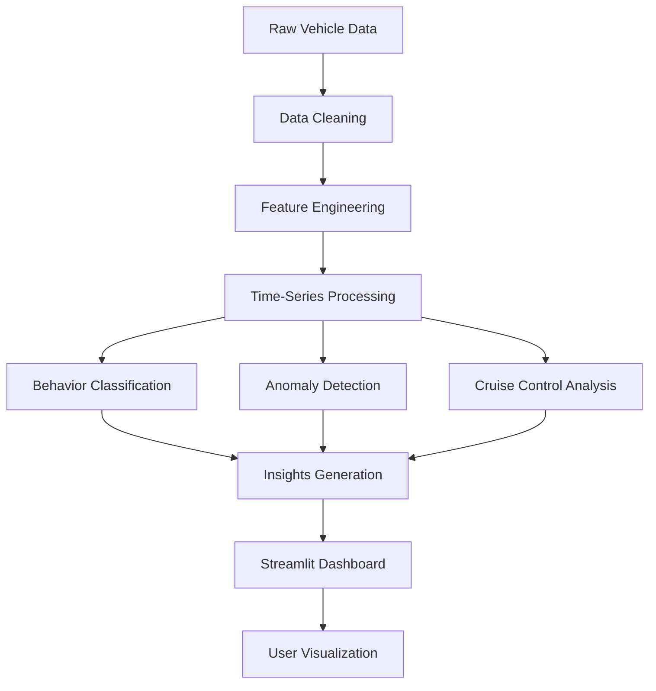

# 🚗 Automotive Data Analysis Dashboard

An end-to-end **automotive telemetry analytics system** built using Python and Streamlit to process, analyze, and visualize **time-series vehicle data at scale**.

---

## 🔥 Overview

This project simulates a **real-world automotive data pipeline**, transforming raw vehicle signals into actionable insights through **feature engineering, anomaly detection, and behavioral analytics**.

Designed with a **modular, production-style architecture**, it mirrors how modern automotive systems process **CAN bus-like telemetry data**.

---

## 🎯 Key Features

- 📊 Processed ** vehicle telemetry records** (speed, RPM, throttle, engine temperature)
- ⚙️ Built scalable **data preprocessing & feature engineering pipelines**
- 🚗 Implemented **driving behavior classification** (aggressive, normal, braking)
- 🚨 Designed **anomaly detection system** (overspeeding, harsh acceleration, overheating)
- 🔍 Performed **cruise control analysis**
- 📈 Developed **interactive Streamlit dashboard** for real-time visualization

---

## 🧠 What Makes This Strong

- ✅ **Production-style pipeline design** (not just notebooks)
- ✅ **Modular OOP architecture** for scalability & maintainability
- ✅ Simulates **real automotive signal processing workflows**
- ✅ Combines **data engineering + analytics + visualization**

---

## 🛠️ Tech Stack

- **Language:** Python  
- **Data Processing:** Pandas, NumPy  
- **Visualization:** Matplotlib, Streamlit  
- **Architecture:** Object-Oriented Programming (OOP)  
- **Domain:** Automotive Data, Time-Series Analytics  

---

## ⚙️ Architecture



---

## 📸 Demo (Video)

🎥 Watch Project Demo:  
👉 https://drive.google.com/file/d/16mwtLppmw3lonABFGUOlDG4AHe6xRpfT/view?usp=sharing

---

## 🧱 Project Structure

```
Automotive-data-analysis/
│── app.py                # Streamlit dashboard entry point
│── data_processing.py    # Data cleaning & preprocessing
│── feature_engineering.py# Feature extraction logic
│── analysis.py           # Behavior + anomaly detection
│── utils/                # Helper modules
│── requirements.txt      # Dependencies
```

---

## 🚀 Setup & Run Locally

```bash
git clone https://github.com/Shreepriya20/Automotive-data-analysis.git
cd Automotive-data-analysis

pip install -r requirements.txt
streamlit run app.py
```

---

## 📊 Use Cases

- Automotive telemetry analysis  
- Driving behavior monitoring systems  
- Fleet analytics dashboards  
- Predictive maintenance (extension-ready)  

---

## 🏁 Impact

This project demonstrates the ability to:

- Handle **large-scale time-series data**
- Build **modular data pipelines**
- Apply **domain-specific analytics (automotive signals)**
- Deliver **end-to-end data products (backend → dashboard)**

---

## 👩‍💻 Author

**Shreepriya Karane**  
AI & Data Engineer  

